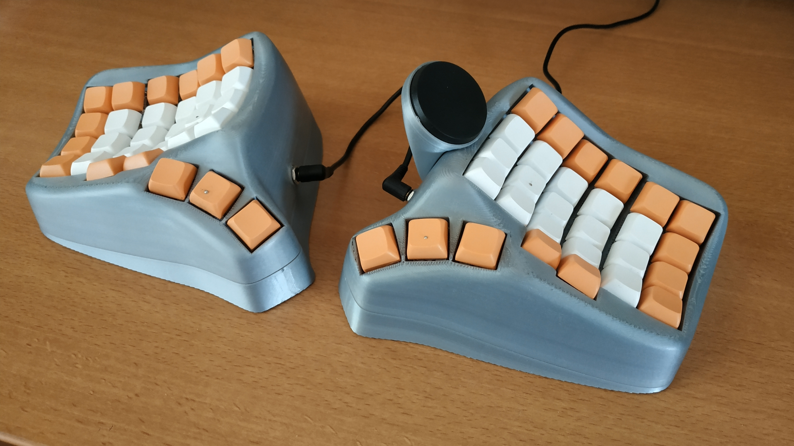

# DactylWave

A smooth Dactyl manuform keyboard

## A few notes

-   I had to bend some of the pico header pins to accomodate the height of the dupont connectors.
-   The tenting bottom includes a hole for inserting a 1/4" T-nut.
-   All the STL are for the left side, including the trackpad support. If you want it on the right side, be sure to mirror it before printing.
-   As I added the trackpad later, the case doesn't include a hole for the wires, I drilled it afterward.
